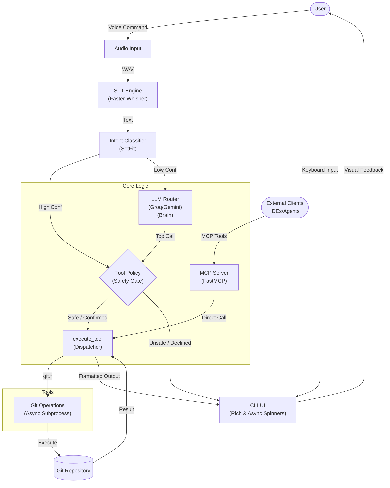

# 🎙️ v-shell (GitVoice)

> **Hands-free Git operations powered by AI.**


**v-shell** (internally GitVoice) is your intelligent voice-controlled assistant for Git. Stop typing repetitive commands and start talking to your repository. Powered by state-of-the-art LLMs and Speech-to-Text technology, it understands your intent and executes Git operations safely and efficiently.

---

## ✨ Key Features

- 🗣️ **Voice-Activated**: Manual "Press Enter to Start/Stop" flow for precise command capture.
- 🧠 **Hybrid Intelligence**: Uses local **SetFit** models for instant reactions to common commands, falling back to LLMs for complex intent.
- 🛡️ **Simplified Safety**: Dangerous commands (`push`, `smart_commit`, `reset`) ask for a simple keyboard "Yes/No". No complex voice confirmations.
- ⚡ **Smart Commit**: Single command: "status -> stage -> generate message -> commit -> push".
- 🎨 **Rich TUI**: Beautiful terminal interface with animated spinners, status indicators, and formatted Git output using Rich library.
- 🔄 **Robustness**: Automatic retries for flaky commands and network issues.
- 📊 **Metrics**: Tracks usage stats for improvement.
- 🔌 **Model Agnostic**: Bring your own keys! Supports **Groq**, **Gemini**, **Ollama**, and **Faster-Whisper**.
- 🔧 **Full Git Toolkit**: Complete set of Git operations including log, add, reset, branch management, stash, revert, merge, and more.

## 🏗️ Architecture



**How the Safety Gate Works:**
- **Read-only tools** (e.g., `git.status`, `git.diff`, `git.log`) → Execute immediately
- **Write tools** (e.g., `git.push`, `git.commit`, `smart_commit_push`) → Prompt user for confirmation
  - If user confirms → Execute
  - If user declines → Cancel operation


## 🛠️ Tech Stack

- **Core**: Python 3.x, Pydantic, GitPython
- **AI/ML**: SetFit (Local), Faster-Whisper, Groq API, Google Gemini, Ollama
- **CLI**: Rich terminal interface (planned)

## 🚀 Getting Started

### Prerequisites

- Python 3.8+
- A microphone
- API Keys for Groq or Gemini (optional but recommended for best performance)

### Installation

```bash
# Clone the repository
git clone https://github.com/Amitro123/V-Shell.git
cd V-Shell

# Create a virtual environment
python -m venv venv

# Activate it
# Windows:
venv\Scripts\activate
# Mac/Linux:
source venv/bin/activate

# Install dependencies
pip install -e .
```

### Configuration

1. Copy the example environment file:
   ```bash
   cp .env.example .env
   ```
2. Edit `.env` and add your API keys:
   ```ini
   GROQ_API_KEY=your_key_here
   GEMINI_API_KEY=your_key_here
   ```

## 🎤 Usage

Start the assistant:

python -m app.main
```

Follow the on-screen prompts:
1. Press **Enter** to START recording.
2. Speak your command (e.g., *"Commit these changes with message 'fix login bug'"*).
3. Press **Enter** to STOP recording.


**Try saying:**
- *"Check the status"*
- *"Show me the log"* or *"Show commit history"*
- *"Show me the diff"*
- *"What changed since origin main"* (Compare against origin/main)
- *"Show diff for app/main.py"* (Path-specific diff)
- *"Create branch feature-login"* (Create and switch to new branch)
- *"Switch to main"* (Switch to existing branch)
- *"Stage all changes"* or *"Add all files"*
- *"Reset last commit"* (Undo commits safely with confirmation)
- *"Smart commit"* (Stages, generates message, confirms, commits, and pushes)
- *"Run tests"*
- *"Pull from origin"*
- *"Push to origin main"*
- *"Fetch latest changes"* (Fetch from remote)
- *"Show remotes"* (List configured remotes)
- *"Stash my changes"* (Save work temporarily)
- *"Apply the last stash"* (Restore stashed changes)
- *"Revert my last commit"* (Create inverse commit)
- *"Merge the feature branch"* (Merge a branch)

## 📂 Project Structure

```
v-shell/
├── app/
│   ├── audio/          # 🎧 Audio recording & STT
│   ├── core/           # ⚙️ Core logic & execution
│   │   ├── executor.py     # execute_tool dispatcher
│   │   ├── models.py       # ToolCall, AppConfig
│   │   └── tools/          # Modular tool implementations
│   │       ├── git_ops/    # status, diff, branch, pull, commit_push
│   │       ├── docker/     # (placeholder)
│   │       └── system/     # (placeholder)
│   ├── llm/            # 🧠 LLM routing & intelligence
│   ├── intent/         # SetFit intent classifier
│   └── mcp/            # MCP Server
├── tests/              # 🧪 Test suite
└── ...
```

## 🤝 Contributing

Contributions are welcome! Please feel free to submit a Pull Request.

## 📄 License

This project is licensed under the MIT License.

## 🔌 MCP Server

GitVoice includes an MCP server that you can connect to IDEs like **Claude Desktop**, **Cursor**, or **Windsurf**. This allows the AI assistant to directly control your git repository.

**Configuration for Claude Desktop:**

```json
{
  "mcpServers": {
    "gitvoice": {
      "command": "python",
      "args": [
        "-m",
        "app.mcp.server"
      ]
    }
  }
}
```

Available tools: `git_status`, `git_log`, `git_add_all`, `git_reset`, `run_tests`, `git_diff`, `git_branch`, `smart_commit_push`, `git_pull`, `git_fetch`, `git_remote_list`, `git_stash_push`, `git_stash_pop`, `git_revert`, `git_merge`.
