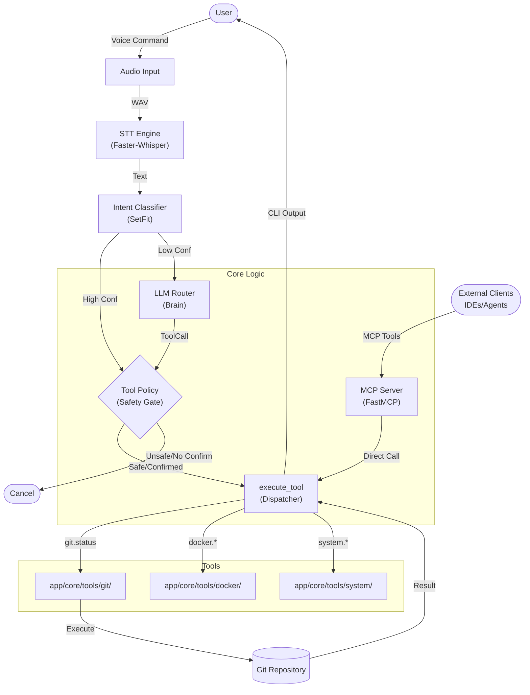

# Project Specification: v-shell (GitVoice)

## Overview
v-shell (internally referred to as GitVoice) is a voice-controlled shell assistant designed to enable hands-free Git operations. It leverages Large Language Models (LLMs) and Speech-to-Text (STT) technologies to interpret natural language voice commands and execute corresponding Git actions.

## Goals
- Provide a seamless voice interface for common Git workflows.
- Ensure safety and reliability with confirmation steps for destructive actions.
- Support multiple LLM and STT providers for flexibility.
- Maintain a modular and extensible architecture.

## Core Features

### Voice & Intent
- **Manual Trigger**: "Press Enter to Start/Stop" flow for reliable audio capture.
- **Wake Word Detection**: (Future Scope) Currently disabled in favor of manual control.
- **Speech-to-Text**: Transcription of voice commands using providers like Faster-Whisper or Groq.
- **Hybrid Intent Classification**:
    - **Local (SetFit)**: Fast, offline classification for common commands (`status`, `test`, `push`).
    - **Cloud (LLM)**: Fallback to Groq/Gemini/Ollama for complex queries.

### Git Operations
Supported commands include:
- `git status`: Check repository status.
- `git log`: View commit history with customizable limit:
    - Default: `git.log(limit=20)`
    - Custom: `git.log(limit=50)`
- `git diff`: Show changes with advanced filtering:
    - Path filtering: `git.diff(path="app/main.py")`
    - Compare against origin/main: `git.diff(since_origin_main=True)`
- `git add all`: Stage all changes (`git add -A`).
- `git commit`: Commit changes with AI-generated or user-provided messages.
- `git push`: Push commits to remote.
- `git pull`: Pull changes from remote.
- `git reset`: Safely reset HEAD with strict safety limits:
    - Modes: `soft`, `mixed`, `hard`
    - Steps limited to 1-3 commits for safety
    - Requires explicit confirmation
    - Example: `git.reset(mode="soft", steps=1)`
- `git branch`: Create or switch branches (requires explicit `name` parameter):
    - Create new branch: `git.branch(name="feature", create=True)`
    - Switch to existing branch: `git.branch(name="main", create=False)`
- `smart commit`: Automatically stage, generate message (with user confirmation), commit, and push.
- `run tests`: Run project tests (e.g., pytest) with formatted summary output.

### Safety & Configuration
- **Tool Policies**: Granular control over safety and retries via `ToolPolicy`.
    - **Confirmation**: Simple keyboard confirmation (`Confirm.ask`) for destructive actions (push, pull, commit, reset). No voice confirmation.
    - **Retries**: Automatic retries for flaky commands (e.g., network issues, test failures).
- **Configurable Providers**: Switch between different LLM and STT backends via `config.py` / `.env`.
- **Metrics**: Usage logging to `metrics.jsonl` for debugging and analysis.

### MCP Server (Model Context Protocol)
- **FastMCP Server**: Exposes Git tools to external clients (IDEs, Agents).
- **Tools Exposed**:
    - `git_status`: Returns status and exit code.
    - `git_log`: View commit history.
    - `git_add_all`: Stage all changes.
    - `git_reset`: Reset HEAD with safety checks.
    - `run_tests`: Runs configured tests with summary.
    - `git_diff`: Returns diff with optional path filtering and origin/main comparison.
    - `git_branch`: Create or switch branches.
    - `smart_commit_push`: Auto-stage, commit, push (client handles confirmation).
    - `git_pull`: Pulls changes.
- **Entry Point**: `app/mcp/server.py`

## Architecture

1.  **Audio Input**: Captures user voice.
2.  **STT Engine**: Transcribes audio to text (English enforced).
3.  **Intent Router**:
    - **Fast Path**: SetFit classifier checks for common intents locally.
    - **Slow Path**: LLM Router analyzes complex text if SetFit confidence is low.
4.  **Tool Policy**: Checks safety requirements and retry configuration.
5.  **Tool Dispatcher (`execute_tool`)**: Routes `ToolCall` to modular tool implementations in `app/core/tools/`.
6.  **Feedback**: Returns success/failure status and output to the user (via CLI/TTS).

## Tech Stack
- **Language**: Python 3.x
- **Core Libraries**:
    - `pydantic`: Data validation and settings management.
    - `GitPython`: Interaction with Git repositories.
- **AI/ML**:
    - `faster-whisper` / `groq`: Speech-to-Text.
    - `setfit` / `sentence-transformers`: Local intent classification.
    - `groq` / `google-generativeai` / `ollama`: LLM inference.
- **Integration**:
    - `mcp`: Model Context Protocol for IDE integration.
- **Testing**: `pytest`

## Project Structure
- `app/`: Main application source code.
    - `core/`: Core logic.
        - `executor.py`: `execute_tool` dispatcher function.
        - `models.py`: Pydantic models (`ToolCall`, `AppConfig`).
        - `tools/`: Modular tool implementations.
            - `git_ops/`: `status.py`, `log.py`, `add.py`, `reset.py`, `diff.py`, `branch.py`, `pull.py`, `commit_push.py`, `test_runner.py`, `utils.py`
            - `docker/`: Placeholder (`containers.py`)
            - `system/`: Placeholder (`shell.py`)
    - `audio/`: Audio recording and processing.
    - `llm/`: LLM integration and routing.
    - `intent/`: SetFit intent classifier.
    - `mcp/`: FastMCP server (`server.py`).
- `tests/`: Test suite.
